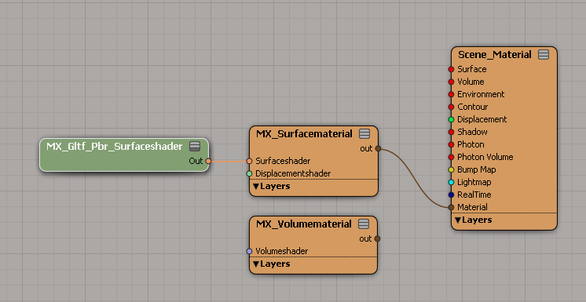
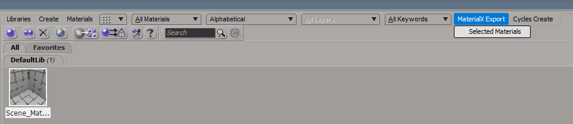
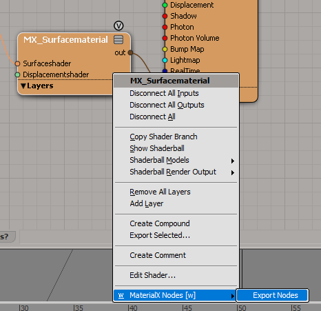
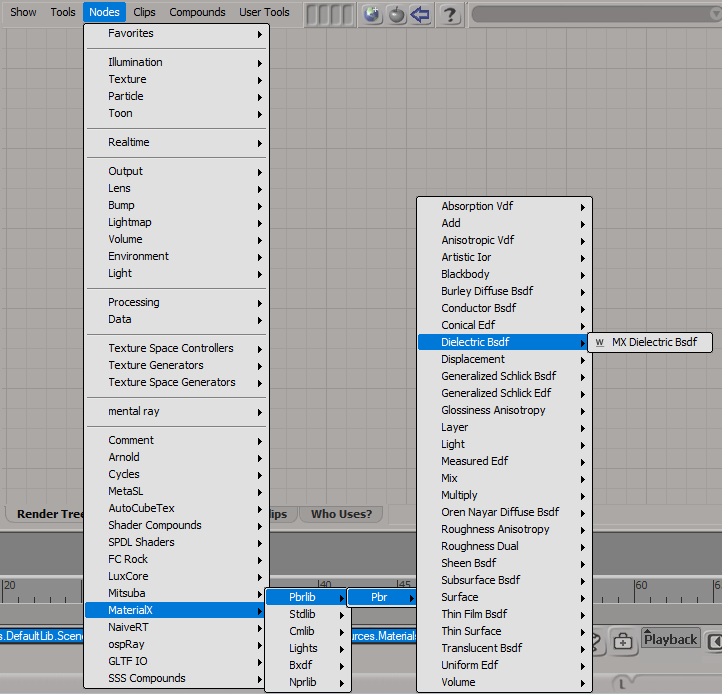
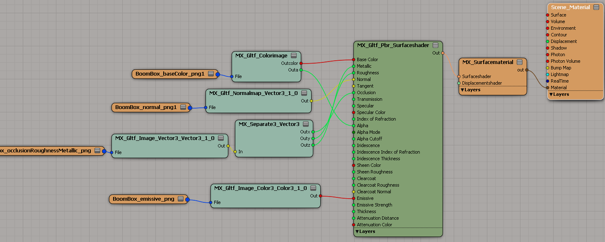
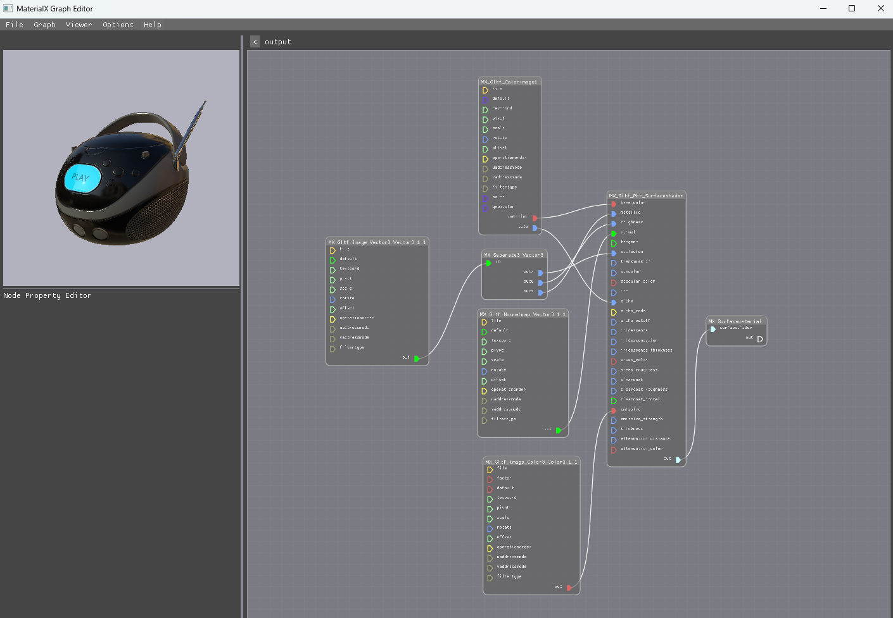
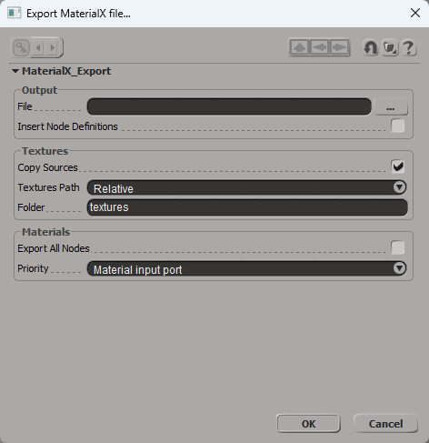

### What is it

The repository contains sources of the addon for [Softimage](https://en.wikipedia.org/wiki/Autodesk_Softimage), which implements initial support of the [MaterialX](https://materialx.org/).

### Supported features
* Export any nodes from Shader Tree into *.mtlx
* Nodes from default MaterialX library exports as native nodes
* Export as whole material and selected sets of nodes

### Limitations

MaterialX format does not supports nested node graphs (compounds in the Softimage terminology). So, if compound is placed inside another compound, then the export process skip this inner compound (and all nodes, connected to them).

### How to export

Install as usual addon for Softimage.

MaterialX nodes should be connected to the ```material``` port of the root material node by using ```MX Surfacematerial``` or ```MX Volumematerial``` nodes.



To export the whole material call ```MaterialX Export``` - ```Selected Materials``` from menu in Material Manager.



To export selected nodes call ```MaterialX Nodes``` - ```Export Nodes``` from context menu. 



Nodes from default library placed under ```MaterialX``` - ```Pbrlib```/```Stdlib```/```Cmlib```/```Lights```/```Bxdf```/```Nprlib``` categories.



There are totally 766 shader nodes. Most of them are duplicates for different input/output types.

The following Shader Tree



exports as the following mtlx-file

```xml
<?xml version="1.0"?>
<materialx version="1.38">
  <surfacematerial name="MX_Surfacematerial" type="material" target="MaterialX">
    <input name="surfaceshader" type="surfaceshader" nodename="MX_Gltf_Pbr_Surfaceshader" />
  </surfacematerial>
  <gltf_pbr name="MX_Gltf_Pbr_Surfaceshader" type="surfaceshader" target="MaterialX">
    <input name="base_color" type="color3" value="1, 1, 1" nodename="MX_Gltf_Colorimage1" output="outcolor" />
    <input name="metallic" type="float" value="1" nodename="MX_Separate3_Vector3" output="outz" />
    <input name="roughness" type="float" value="1" nodename="MX_Separate3_Vector3" output="outy" />
    <input name="normal" type="vector3" value="0, 0, 0" nodename="MX_Gltf_Normalmap_Vector3_1_1" />
    <input name="tangent" type="vector3" value="0, 0, 0" />
    <input name="occlusion" type="float" value="1" nodename="MX_Separate3_Vector3" output="outx" />
    <input name="transmission" type="float" value="0" />
    <input name="specular" type="float" value="1" />
    <input name="specular_color" type="color3" value="1, 1, 1" />
    <input name="ior" type="float" value="1.5" />
    <input name="alpha" type="float" value="1" nodename="MX_Gltf_Colorimage1" output="outa" />
    <input name="alpha_mode" type="integer" value="0" />
    <input name="alpha_cutoff" type="float" value="0.5" />
    <input name="iridescence" type="float" value="0" />
    <input name="iridescence_ior" type="float" value="1.3" />
    <input name="iridescence_thickness" type="float" value="100" />
    <input name="sheen_color" type="color3" value="0, 0, 0" />
    <input name="sheen_roughness" type="float" value="0" />
    <input name="clearcoat" type="float" value="0" />
    <input name="clearcoat_roughness" type="float" value="0" />
    <input name="clearcoat_normal" type="vector3" value="0, 0, 0" />
    <input name="emissive" type="color3" value="0, 0, 0" nodename="MX_Gltf_Image_Color3_Color3_1_1" />
    <input name="emissive_strength" type="float" value="1" />
    <input name="thickness" type="float" value="0" />
    <input name="attenuation_distance" type="float" value="0" />
    <input name="attenuation_color" type="color3" value="1, 1, 1" />
  </gltf_pbr>
  <gltf_colorimage name="MX_Gltf_Colorimage1" type="multioutput" target="MaterialX">
    <input name="file" type="filename" value="textures\BoomBox_baseColor.png" colorspace="srgb_texture" />
    <input name="default" type="color4" value="0, 0, 0, 0" />
    <input name="texcoord" type="vector2" value="0, 0" />
    <input name="pivot" type="vector2" value="0, 1" />
    <input name="scale" type="vector2" value="1, 1" />
    <input name="rotate" type="float" value="0" />
    <input name="offset" type="vector2" value="0, 0" />
    <input name="operationorder" type="integer" value="1" />
    <input name="uaddressmode" type="string" value="periodic" />
    <input name="vaddressmode" type="string" value="periodic" />
    <input name="filtertype" type="string" value="linear" />
    <input name="color" type="color4" value="1, 1, 1, 1" />
    <input name="geomcolor" type="color4" value="1, 1, 1, 1" />
  </gltf_colorimage>
  <separate3 name="MX_Separate3_Vector3" type="multioutput" target="MaterialX">
    <input name="in" type="vector3" value="0, 0, 0" nodename="MX_Gltf_Image_Vector3_Vector3_1_1" />
  </separate3>
  <gltf_image name="MX_Gltf_Image_Vector3_Vector3_1_1" type="vector3" target="MaterialX">
    <input name="file" type="filename" value="textures\BoomBox_occlusionRoughnessMetallic.png" colorspace="lin_rec709" />
    <input name="default" type="vector3" value="0, 0, 0" />
    <input name="texcoord" type="vector2" value="0, 0" />
    <input name="pivot" type="vector2" value="0, 1" />
    <input name="scale" type="vector2" value="1, 1" />
    <input name="rotate" type="float" value="0" />
    <input name="offset" type="vector2" value="0, 0" />
    <input name="operationorder" type="integer" value="0" />
    <input name="uaddressmode" type="string" value="periodic" />
    <input name="vaddressmode" type="string" value="periodic" />
    <input name="filtertype" type="string" value="linear" />
  </gltf_image>
  <gltf_normalmap name="MX_Gltf_Normalmap_Vector3_1_1" type="vector3" target="MaterialX">
    <input name="file" type="filename" value="textures\BoomBox_normal.png" colorspace="lin_rec709" />
    <input name="default" type="vector3" value="0.5, 0.5, 1" />
    <input name="texcoord" type="vector2" value="0, 0" />
    <input name="pivot" type="vector2" value="0, 1" />
    <input name="scale" type="vector2" value="1, 1" />
    <input name="rotate" type="float" value="0" />
    <input name="offset" type="vector2" value="0, 0" />
    <input name="operationorder" type="integer" value="0" />
    <input name="uaddressmode" type="string" value="periodic" />
    <input name="vaddressmode" type="string" value="periodic" />
    <input name="filtertype" type="string" value="linear" />
  </gltf_normalmap>
  <gltf_image name="MX_Gltf_Image_Color3_Color3_1_1" type="color3" target="MaterialX">
    <input name="file" type="filename" value="textures\BoomBox_emissive.png" colorspace="lin_rec709" />
    <input name="factor" type="color3" value="1, 1, 1" />
    <input name="default" type="color3" value="0, 0, 0" />
    <input name="texcoord" type="vector2" value="0, 0" />
    <input name="pivot" type="vector2" value="0, 1" />
    <input name="scale" type="vector2" value="1, 1" />
    <input name="rotate" type="float" value="0" />
    <input name="offset" type="vector2" value="0, 0" />
    <input name="operationorder" type="integer" value="0" />
    <input name="uaddressmode" type="string" value="periodic" />
    <input name="vaddressmode" type="string" value="periodic" />
    <input name="filtertype" type="string" value="linear" />
  </gltf_image>
</materialx>
```

To the sample MaterialX application ```MaterialXGraphEditor``` it imports as follows



### Export options



**File** The path to the output mtlx file
**Insert Node Definitions** If *true* then all nodes not from default materialX library will be exported with node definitions. These definitions contains names, types and values for all input and output ports of the shader node.
**Copy Sources** if *true* then textures will be copied to the separate directory.
**Textures Path** Define how links to textures should be stored in the output mtlx-file.
**Folder** The name of the folder with textures if the parameter *Copy Sources* is activated.
**Export All Nodes** (only for materials) If *true* then all nodes from the material will be exported. If *false* then export only nodes which have connections with the root material node.
**Priority** (only for materials) If choose *Material input port* then the exporter first check the material port of the root material node and try to export connected nodes as native MaterialX nodes. If material connected to MAterialX nodes, then it ignores all other ports. In other case it export connections to other (non-material) ports of the root material node. If choose *All connections* then simply export all connections.