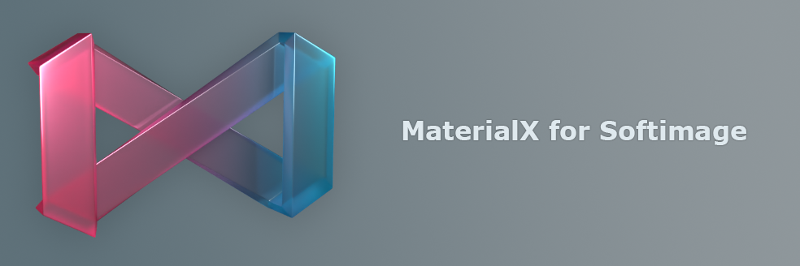

### What is it

The repository contains sources of the addon for [Softimage](https://en.wikipedia.org/wiki/Autodesk_Softimage), which implements initial support of the [MaterialX](https://materialx.org/).

### Supported features

* Export any nodes from Shader Tree into either native *.mtlx, or to *.osl, *.glsl, *.mdl and *.msl shader formats
* Nodes from default MaterialX library exports as native nodes
* Export as whole material and selected sets of nodes
* Viewer (based on Custom Display Host) for preview surface materials

### Limitations

MaterialX format does not supports nested node graphs (compounds in the Softimage terminology). So, if compound is placed inside another compound, then the export process skip this inner compound (and all nodes, connected to them).

### How to build

Addon package can be downloaded from the [release](https://github.com/Tugcga/MaterialXSI/releases) page.

Addon implemented by using C++ API. It required some external libraries. Download the archive ```external.zip``` from the [release](https://github.com/Tugcga/MaterialXSI/releases/tag/externals.03) and extract the content of the archive into the folder ```internal``` at the root of the repository. Then you can open Visual Studio solution from ```src``` directory and build it. The project required Visual Studio 2019.

### How to use

Install as usual addon for Softimage.

MaterialX nodes should be connected to the ```material``` port of the root material node by using one of three nodes:

* `MX Surfacematerial`

* `MX Volumematerial`

* `MX Lama Surface`

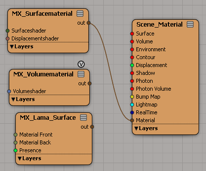

To export the whole material into native *.mtlx format call ```MaterialX Export``` - ```Materials to ...mtlx``` from menu in Material Manager.

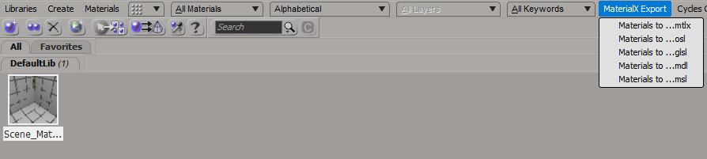

To export selected nodes call ```MaterialX Nodes``` - ```Export to ...mtlx``` from context menu. 

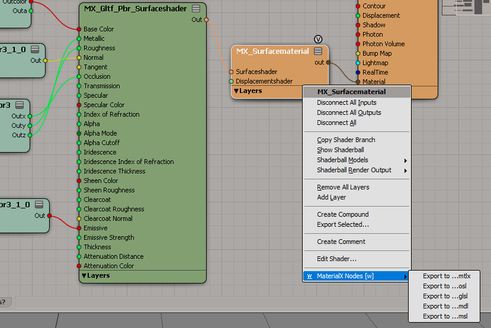

Nodes from default library placed under ```MaterialX``` - ```Pbrlib```/```Stdlib```/```Cmlib```/```Lights```/```Bxdf```/```Nprlib``` categories.

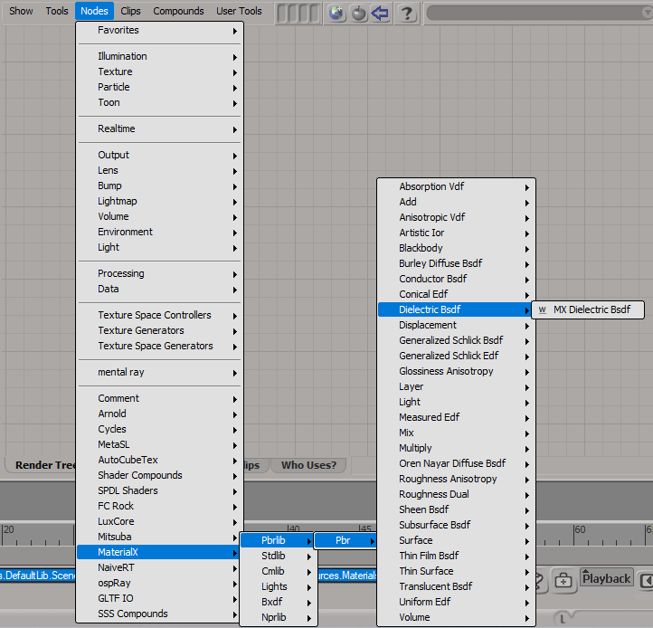

There are totally 807 shader nodes. Most of them are duplicates for different input/output types.

The following Shader Tree

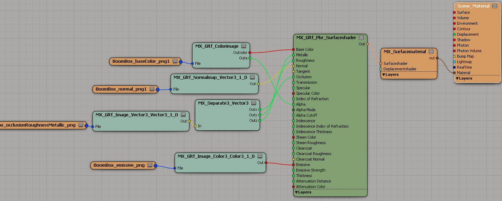

exports as the following mtlx-file

```xml
<?xml version="1.0"?>
<materialx version="1.38">
  <surfacematerial name="MX_Surfacematerial" type="material" target="MaterialX">
    <input name="surfaceshader" type="surfaceshader" nodename="MX_Gltf_Pbr_Surfaceshader" />
  </surfacematerial>
  <gltf_pbr name="MX_Gltf_Pbr_Surfaceshader" type="surfaceshader" target="MaterialX">
    <input name="base_color" type="color3" value="1, 1, 1" nodename="MX_Gltf_Colorimage1" output="outcolor" />
    <input name="metallic" type="float" value="1" nodename="MX_Separate3_Vector3" output="outz" />
    <input name="roughness" type="float" value="1" nodename="MX_Separate3_Vector3" output="outy" />
    <input name="normal" type="vector3" value="0, 0, 0" nodename="MX_Gltf_Normalmap_Vector3_1_1" />
    <input name="tangent" type="vector3" value="0, 0, 0" />
    <input name="occlusion" type="float" value="1" nodename="MX_Separate3_Vector3" output="outx" />
    <input name="transmission" type="float" value="0" />
    <input name="specular" type="float" value="1" />
    <input name="specular_color" type="color3" value="1, 1, 1" />
    <input name="ior" type="float" value="1.5" />
    <input name="alpha" type="float" value="1" nodename="MX_Gltf_Colorimage1" output="outa" />
    <input name="alpha_mode" type="integer" value="0" />
    <input name="alpha_cutoff" type="float" value="0.5" />
    <input name="iridescence" type="float" value="0" />
    <input name="iridescence_ior" type="float" value="1.3" />
    <input name="iridescence_thickness" type="float" value="100" />
    <input name="sheen_color" type="color3" value="0, 0, 0" />
    <input name="sheen_roughness" type="float" value="0" />
    <input name="clearcoat" type="float" value="0" />
    <input name="clearcoat_roughness" type="float" value="0" />
    <input name="clearcoat_normal" type="vector3" value="0, 0, 0" />
    <input name="emissive" type="color3" value="0, 0, 0" nodename="MX_Gltf_Image_Color3_Color3_1_1" />
    <input name="emissive_strength" type="float" value="1" />
    <input name="thickness" type="float" value="0" />
    <input name="attenuation_distance" type="float" value="0" />
    <input name="attenuation_color" type="color3" value="1, 1, 1" />
  </gltf_pbr>
  <gltf_colorimage name="MX_Gltf_Colorimage1" type="multioutput" target="MaterialX">
    <input name="file" type="filename" value="textures\BoomBox_baseColor.png" colorspace="srgb_texture" />
    <input name="default" type="color4" value="0, 0, 0, 0" />
    <input name="texcoord" type="vector2" value="0, 0" />
    <input name="pivot" type="vector2" value="0, 1" />
    <input name="scale" type="vector2" value="1, 1" />
    <input name="rotate" type="float" value="0" />
    <input name="offset" type="vector2" value="0, 0" />
    <input name="operationorder" type="integer" value="1" />
    <input name="uaddressmode" type="string" value="periodic" />
    <input name="vaddressmode" type="string" value="periodic" />
    <input name="filtertype" type="string" value="linear" />
    <input name="color" type="color4" value="1, 1, 1, 1" />
    <input name="geomcolor" type="color4" value="1, 1, 1, 1" />
  </gltf_colorimage>
  <separate3 name="MX_Separate3_Vector3" type="multioutput" target="MaterialX">
    <input name="in" type="vector3" value="0, 0, 0" nodename="MX_Gltf_Image_Vector3_Vector3_1_1" />
  </separate3>
  <gltf_image name="MX_Gltf_Image_Vector3_Vector3_1_1" type="vector3" target="MaterialX">
    <input name="file" type="filename" value="textures\BoomBox_occlusionRoughnessMetallic.png" colorspace="lin_rec709" />
    <input name="default" type="vector3" value="0, 0, 0" />
    <input name="texcoord" type="vector2" value="0, 0" />
    <input name="pivot" type="vector2" value="0, 1" />
    <input name="scale" type="vector2" value="1, 1" />
    <input name="rotate" type="float" value="0" />
    <input name="offset" type="vector2" value="0, 0" />
    <input name="operationorder" type="integer" value="0" />
    <input name="uaddressmode" type="string" value="periodic" />
    <input name="vaddressmode" type="string" value="periodic" />
    <input name="filtertype" type="string" value="linear" />
  </gltf_image>
  <gltf_normalmap name="MX_Gltf_Normalmap_Vector3_1_1" type="vector3" target="MaterialX">
    <input name="file" type="filename" value="textures\BoomBox_normal.png" colorspace="lin_rec709" />
    <input name="default" type="vector3" value="0.5, 0.5, 1" />
    <input name="texcoord" type="vector2" value="0, 0" />
    <input name="pivot" type="vector2" value="0, 1" />
    <input name="scale" type="vector2" value="1, 1" />
    <input name="rotate" type="float" value="0" />
    <input name="offset" type="vector2" value="0, 0" />
    <input name="operationorder" type="integer" value="0" />
    <input name="uaddressmode" type="string" value="periodic" />
    <input name="vaddressmode" type="string" value="periodic" />
    <input name="filtertype" type="string" value="linear" />
  </gltf_normalmap>
  <gltf_image name="MX_Gltf_Image_Color3_Color3_1_1" type="color3" target="MaterialX">
    <input name="file" type="filename" value="textures\BoomBox_emissive.png" colorspace="lin_rec709" />
    <input name="factor" type="color3" value="1, 1, 1" />
    <input name="default" type="color3" value="0, 0, 0" />
    <input name="texcoord" type="vector2" value="0, 0" />
    <input name="pivot" type="vector2" value="0, 1" />
    <input name="scale" type="vector2" value="1, 1" />
    <input name="rotate" type="float" value="0" />
    <input name="offset" type="vector2" value="0, 0" />
    <input name="operationorder" type="integer" value="0" />
    <input name="uaddressmode" type="string" value="periodic" />
    <input name="vaddressmode" type="string" value="periodic" />
    <input name="filtertype" type="string" value="linear" />
  </gltf_image>
</materialx>
```

To the sample MaterialX application ```MaterialXGraphEditor``` it imports as follows

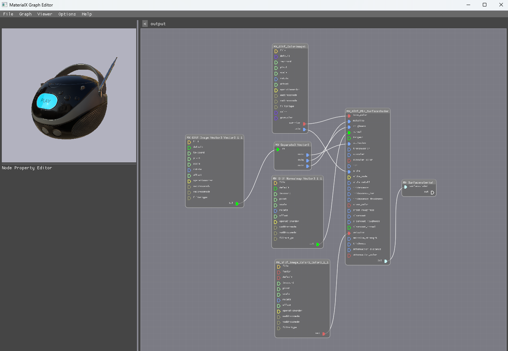

It's possible to export a shader tree with native MaterialX nodes to other shader formats: *.osl, *.glsl, *.mdl or *.msl. This process is implemented by using the MaterialX feature to convert native *.mtls format to another. So under the hood it first creates an *.mtlx material and then generates osl, glsl, mdl or msl codes.

### Export options

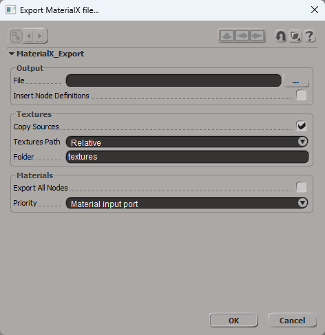

* **File** The path to the output mtlx file
* **Insert Node Definitions** If *true* then all nodes not from default materialX library will be exported with node definitions. These definitions contains names, types and values for all input and output ports of the shader node.
* **Copy Sources** if *true* then textures will be copied to the separate directory.
* **Textures Path** Define how links to textures should be stored in the output mtlx-file.
* **Folder** The name of the folder with textures if the parameter *Copy Sources* is activated.
* **Export All Nodes** (only for materials) If *true* then all nodes from the material will be exported. If *false* then export only nodes which have connections with the root material node.
* **Priority** (only for materials) If choose *Material input port* then the exporter first check the material port of the root material node and try to export connected nodes as native MaterialX nodes. If material connected to MAterialX nodes, then it ignores all other ports. In other case it export connections to other (non-material) ports of the root material node. If choose *All connections* then simply export all connections.

### Viewer

The viewer allows previewing surface materials built using only native MaterialX nodes. Under the hood, it converts the shader network into a GLSL shader and uses OpenGL to render the scene.

To open the viewer window, either choose `window title` - `Custom Displays` - `MaterialXView`.

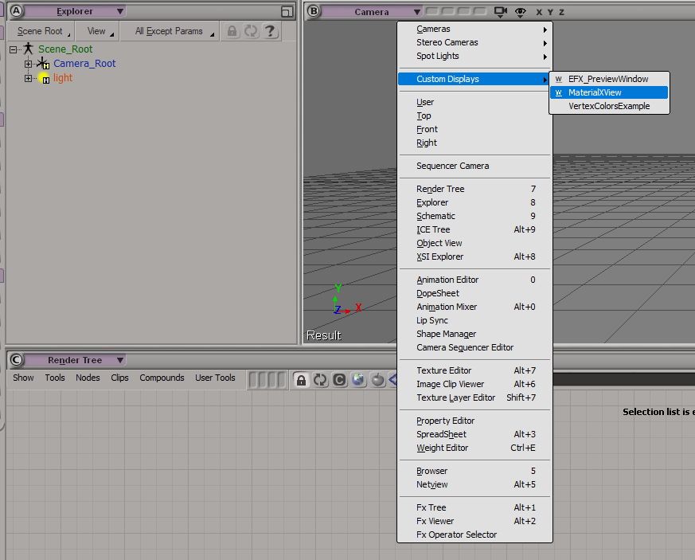

or open a separate CDH window by clicking `View` - `General` - `Custom Display Host`.

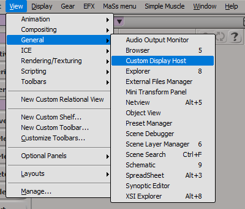

and then select `MaterialXView` display

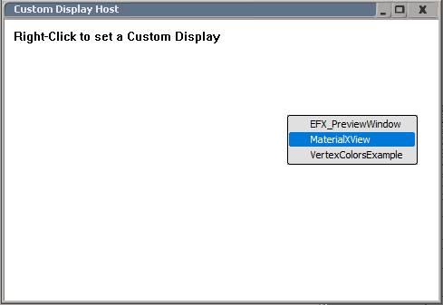

#### Examples

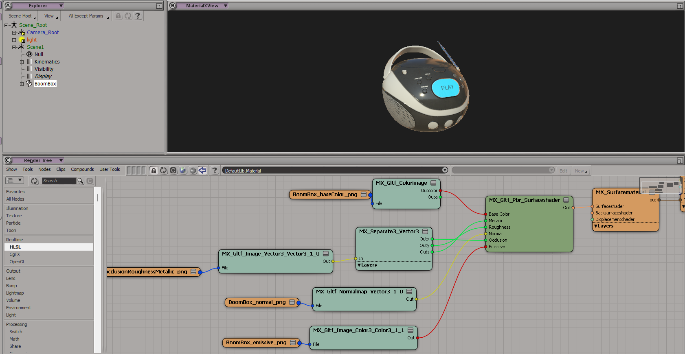

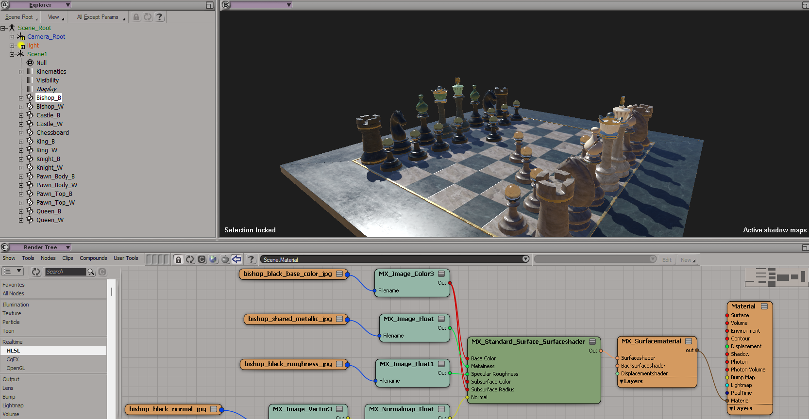

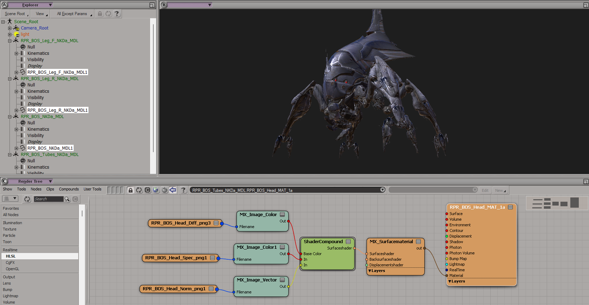

#### How to use the Viewer

The viewer shows only selected polygon mesh objects. Rotate the camera by using `LMB` (Left Mouse Button), zoom by using `WMB` (Wheel Mouse Button, simply scroll it), pan by using `MMB` (Middle Mouse Button, same as scrolling, but hold it pressed), and rotate the scene light by using `RMB` (Right Mouse Button). The viewer uses separate IBL (Image-Based Lighting) that is independent of the Softimage scene. By default, three different HDR images are available for lighting. Switch between them using the keyboard arrows.

To lock the selected objects - press `L`.

To frame the camera on the selected objects - press `A`.

To show render statistics - press `I`. This tracks the time for exporting scene meshes (in milliseconds), the time for transforming Render Tree nodes into GLSL shader code (in milliseconds), and the average frame rendering time (in microseconds).

To activate shadow maps - press `S` (note that `S` is not used for camera manipulation inside the viewer, it activates shadows).

To force a mesh rebuild when the frame is changed - press `R`.

#### Viewer settings

There is a file settings.ini in the addon's directory. It allows you to tweak several parameters used by the viewer.

* `Viewer Control`. These parameters change the camera rotation speed, zoom speed, and pan speed.

* `Viewer Camera`. Change the camera FOV.

* `Viewer Light`. Define the size of the map for environment lighting. When the viewer is initialized, it splits the environment HDR into a direct lighting component and an ambient lighting component. If no HDR for ambient light already exists, it creates one using spherical harmonics and stores it in a separate HDR.

* `Viewer Generator`. Define the size of the shadow maps.

* `Viewer UI`: Define the font size and padding for text over the viewer canvas.

* `Hotkeys`. Define the previously mentioned hotkeys.

#### Remarks about the viewer

* MaterialX supports volumetric materials and shaders for lights, but the viewer renders only surface shaders. Materials of other types can be stored in .mtlx files but cannot be compiled into other shader formats (such as GLSL, etc.).

* The Viewer is based on the CDH plugin for Softimage. It updates the state with respect to supported callbacks. In some cases, when Softimage thinks that nothing should be changed, the callback is not fired. To force an update of the material, it is sufficient to change the network topology (add or remove any connection). Then it will be re-exported and recompiled. If the mesh should be forced to update, then it is possible to activate Rebuild Animated Mesh (default hotkey R) and change the frame.